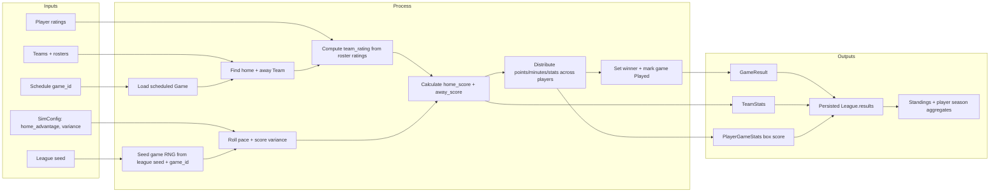

# Simulation Flow

## Summary

Inputs: persisted league, target `game_id`, roster ratings, and `SimConfig`.

Process: find matchup, derive team strength, create deterministic game RNG, roll score, generate player lines, mark game played.

Outputs: final score, winner, team stats, player box score, persisted result, standings, and season stat aggregates.
